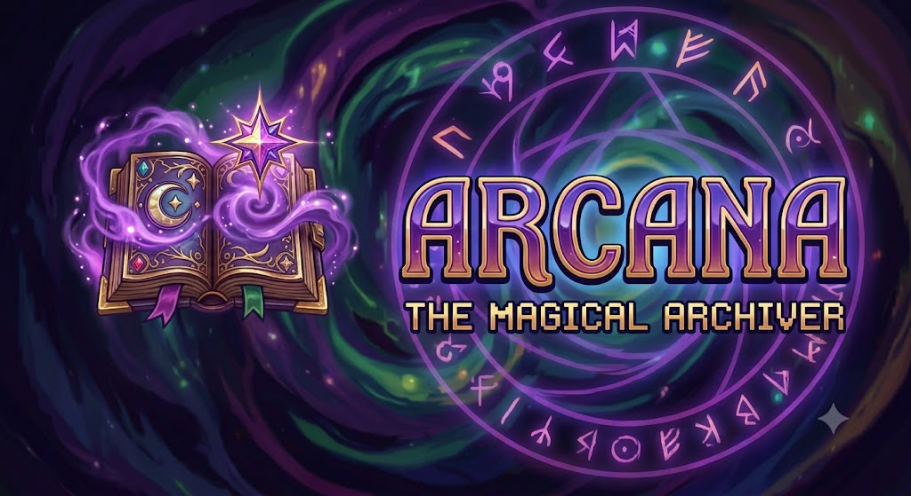

<p align="center">
  
</p>

# Arcana

<p align="center">
  <b>The versatile, professional archiver.</b><br/>
  One tool for every archive you'll ever touch — open, create, convert, encrypt, split, hash and preview.
</p>

<p align="center">
  
  
  
  
  
  
</p>

---

**Arcana** is a fast, open-source file archiver built with C# and Avalonia. It combines the format coverage of a classic archiver with a modern, clean UI — and a full command-line toolkit underneath. Whether you're packing a release, opening a legacy archive from 1995, splitting a file for upload, or checking a checksum, Arcana is built to handle it.

- 🖥️ **One app for Windows, macOS and Linux** — native Avalonia UI, dark theme included
- 🗂️ **17 built-in engines + fallback support for 240+ formats** — from ZIP and 7z to ACE, ARJ, CAB, LZH, and everything in between
- 🚀 **Modern compression** — Zstandard, Brotli, LZ4, LZMA, XZ, Snappy alongside the classics
- 🔐 **Strong encryption** — AES-256-GCM authenticated encryption, Argon2id key derivation
- 🧰 **Built-in tools** — split, join, hash, convert and benchmark, no extra downloads
- 👀 **Instant preview** — text, images and hex dumps right inside the app
- 🧩 **GUI + CLI** — a desktop app for day-to-day work, a scriptable CLI for automation

---

## Why Arcana?

| Feature | **Arcana** | WinRAR | 7-Zip | PeaZip |
|---|---|---|---|---|
| Cross-platform (Win/macOS/Linux) | ✅ Native | ❌ Windows only | ⚠️ Windows + community builds | ✅ |
| Modern formats (Zstandard, Brotli, LZ4, Snappy) | ✅ | ⚠️ Partial | ⚠️ Plugins | ⚠️ Partial |
| Legacy formats (RAR, ACE, ARJ, CAB, LZH) | ✅ | ⚠️ RAR only | ⚠️ Partial | ⚠️ Partial |
| Hidden/embedded archives (MSIX, MSI, EXE, APPX, CHM, WIM, EPUB, game packs) | ✅ 240+ via fallback | ❌ | ⚠️ Partial | ⚠️ Partial |
| Modern authenticated encryption (AES-256-GCM) | ✅ | ❌ AES-CBC only | ❌ AES-CBC only | ❌ AES-CBC only |
| Internal preview (text / image / hex) | ✅ | ⚠️ Viewer | ❌ | ✅ |
| Built-in tools (split, join, hash, convert) | ✅ | ⚠️ Partial | ❌ | ⚠️ Partial |
| Open source | ✅ GPLv3 | ❌ Proprietary | ✅ LGPL | ✅ LGPL |

## ✨ Highlights

**Explore like a pro.** Folders in the sidebar, files in the list, double-click to navigate, enter/back to go in and out. Classic explorer-style navigation, done right.

**Preview without extracting.** Select a file — see its contents instantly. Text and images load automatically; binary files wait for your "Binary Preview" click instead of flooding the screen with hex.

**Do everything in one place.**
- Split big files into parts (with optional HJSplit-compatible naming) and join them back
- Calculate and verify MD5, SHA-1, SHA-256 and SHA-512 hashes
- Convert archives between formats
- Benchmark engines to pick the fastest for your workload

## 🗜️ Supported Formats

| Format | Read | Write | Encrypt |
|---|---|---|---|
| ZIP | ✅ | ✅ | ✅ |
| 7z | ✅ | ✅ | ✅ |
| Zstandard | ✅ | ✅ | — |
| Tar (+ gz / bz2 / xz / zst) | ✅ | ⚠️ (`.tar.xz` read-only) | — |
| GZip | ✅ | ✅ | — |
| BZip2 | ✅ | ✅ | — |
| XZ | ✅ | ✅ | — |
| LZMA | ✅ | ✅ | — |
| LZ4 | ✅ | ✅ | — |
| Snappy | ✅ | ✅ | — |
| Brotli | ✅ | ✅ | — |
| RAR | ✅ | — | — |
| ACE | ✅ | — | — |
| ARJ | ✅ | — | — |
| CAB | ✅ | — | — |
| LZH / LHA | ✅ | — | — |

> Encryption on ZIP/7z uses Arcana's own AES-256-GCM container. Files encrypted with Arcana are read by Arcana (not by WinZip or 7-Zip).

### Open anything — formats that don't look like archives

Arcana's fallback engine (Hawkynt `FormatRegistry`, 240+ descriptors) detects archives by **content, not extension**. Many files that look like ordinary apps, documents or packages are actually archives underneath:

| Looks like… | Actually… |
|---|---|
| `.msix`, `.appx` | Windows app packages (ZIP/OPC-based) |
| `.msi` | Windows Installer database (OLE/COM compound, embedded CAB) |
| `.exe` | Self-extracting archives & installers (NSIS, Inno Setup, SFX ZIP, UPX, packers) |
| `.esd`, `.wim` | Windows imaging / update containers |
| `.docx`, `.xlsx`, `.pptx`, `.odt`, `.vsdx` | Office documents (ZIP/OPC-based) |
| `.epub`, `.cbz`, `.maff` | E-books and comic books (ZIP-based) |
| `.chm` | Compiled HTML help |
| `.apk`, `.ipa`, `.aab`, `.xpi`, `.nupkg`, `.jar`, `.war`, `.ear` | Mobile / browser / NuGet / Java packages |
| `.deb`, `.rpm`, `.appimage`, `.snap`, `.cpio`, `.ar` | Linux packages and archives |
| `.pak`, `.wad`, `.mpq`, `.vpk`, `.u8`, `.narc`, `.nds` | Game data packs (Quake, Doom, Warcraft III, Source, etc.) |
| `.sit`, `.sitx`, `.zoo`, `.sqx`, `.uharc`, `.arc`, `.lzh`, `.kwaj`, `.dms`, `.yenc` | Legacy & retro formats |

Extraction is best-effort and **read-only**: these descriptors are auto-detected, so quality varies per format. If you work with a specific one heavily, [check its descriptor](docs/compression/FORMATS.md) and test it.

## 🔐 Security

Arcana encrypts with **AES-256-GCM** — authenticated encryption that detects any tampering — and derives keys with **Argon2id**, the memory-hard password hash that resists GPU cracking. Your data stays private and verifiable.

## 🧰 Tools

| Tool | What it does |
|---|---|
| **Split** | Split any file into parts; presets from 100 MB to 4 GB, or custom size. Optional HJSplit-compatible naming (`.001`, `.002`…) |
| **Join** | Reassemble parts back into the original file; auto-discovers part sequences |
| **Hash** | MD5, SHA-1, SHA-256, SHA-512 — calculate and verify |
| **Convert** | Transcode archives between supported formats |
| **Benchmark** | Measure engine speed and pick the right format for your data |

## 🚀 Quick Start

```shell
# Prerequisites: .NET 10 SDK
git clone https://github.com/marcelofrau/arcana
cd arcana

# Desktop app
dotnet run --project src/Arcana.App

# CLI help
dotnet run --project src/Arcana.Cli -- --help
```

### CLI examples

```shell
# Compress into ZIP
arcana compress release/ -o release.zip

# Convert to another format (zip → 7z)
arcana convert release.zip -f 7z -o release.7z

# Extract a 7z (or any supported archive)
arcana extract backup.7z

# List archive contents
arcana list archive.zip

# Split a file into 100 MB parts (HJSplit-compatible naming)
arcana split movie.iso -s 100M --hjsplit -o parts/

# Join parts back
arcana join "parts/movie.iso.001" -o .

# Calculate a hash
arcana hash setup.exe --algorithm sha256

# Verify a hash
arcana hash setup.exe --algorithm sha256 --verify "ab12cd34..."

# Benchmark engines
arcana benchmark
```

## 🛠️ Building

```shell
dotnet build src/Arcana.slnx
dotnet test  src/Arcana.slnx   # 145 tests
```

## 📚 Documentation

| Document | Description |
|---|---|
| [Docs index](docs/README.md) | Full documentation index |
| [Architecture](docs/ARCHITECTURE.md) | System design, layers, data flow |
| [GUI plan](docs/GUI_PLAN.md) | GUI design, controls, icon themes |
| [Specifications](docs/SPECS.md) | Functional and non-functional requirements |
| [Roadmap](docs/ROADMAP.md) | Milestones and timeline |
| [Formats](docs/compression/FORMATS.md) | Supported compression formats details |
| [Security](docs/compression/CIPHERS.md) | Encryption and key-derivation design |
| [CLI reference](docs/api/CLI_API.md) | Commands, arguments, examples |
| [Core API](docs/api/CORE_API.md) | Public API of Arcana.Core |
| [Contributing](docs/contributing/CODING_STANDARDS.md) | Coding guidelines and PR workflow |

## 🧭 Roadmap

- In-app archive editing (rename, delete, add files)
- Drag-and-drop support
- **ChaCha20-Poly1305** encryption alongside AES-GCM
- GitHub Actions CI
- Image conversion (converter tool exists as a stub)
- Distribution packages (winget, brew, apt)

## 📄 License

Arcana is free software, released under the **GNU General Public License v3**.

See [LICENSE](LICENSE) for the full text.
