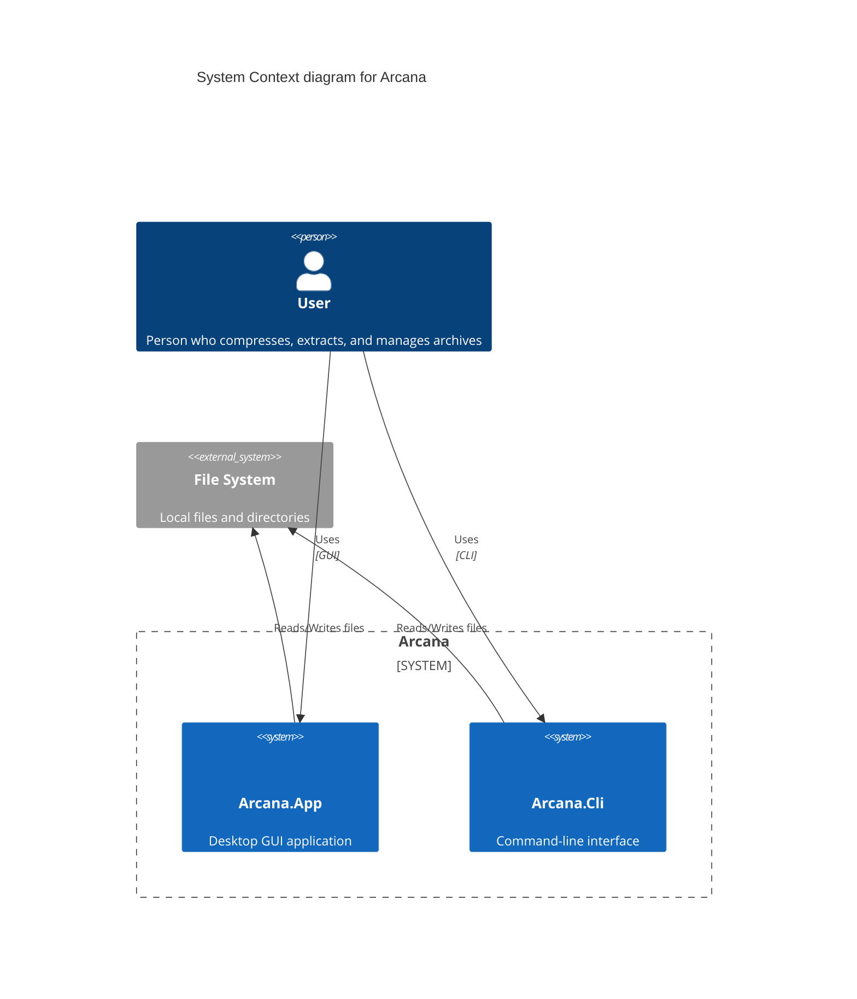
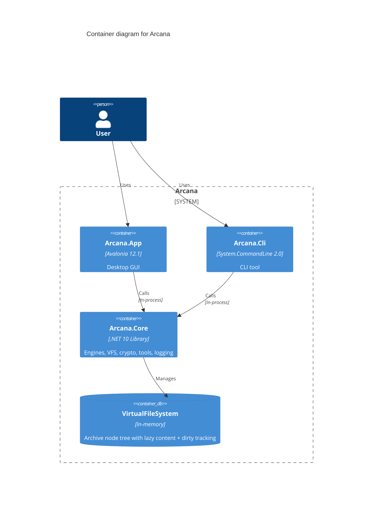
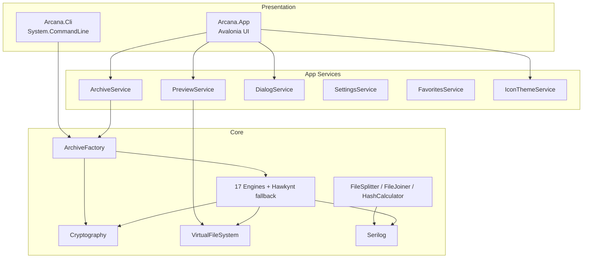
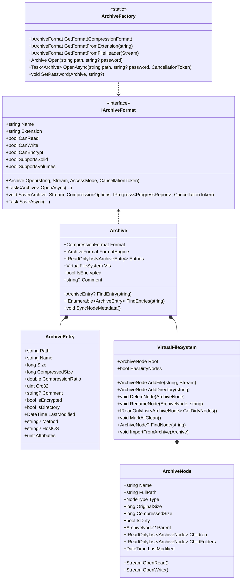
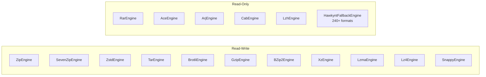
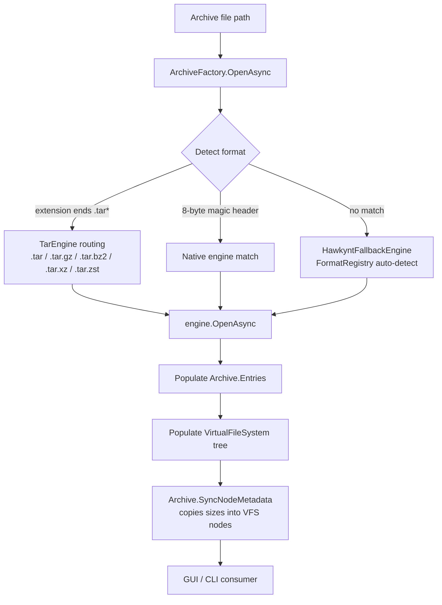
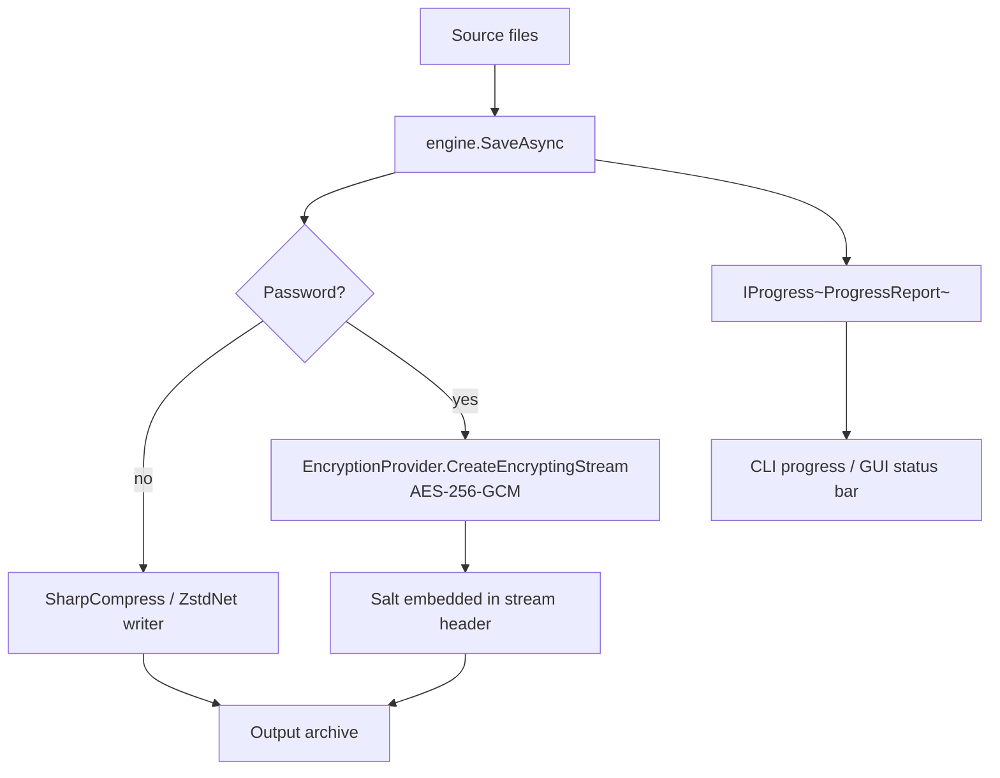
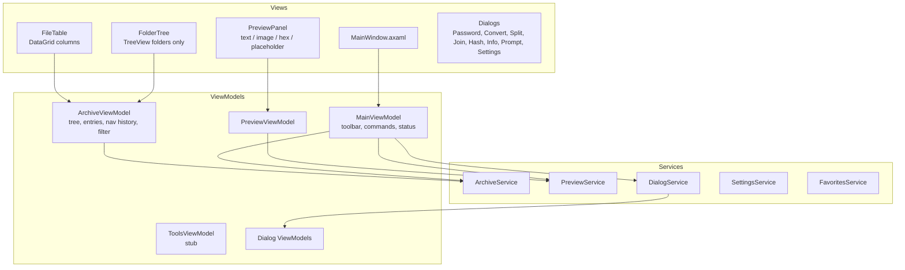
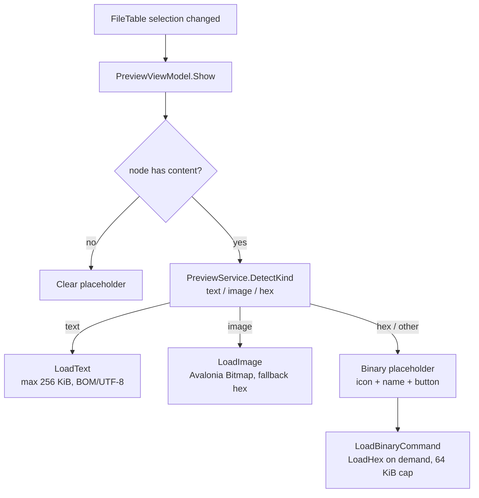
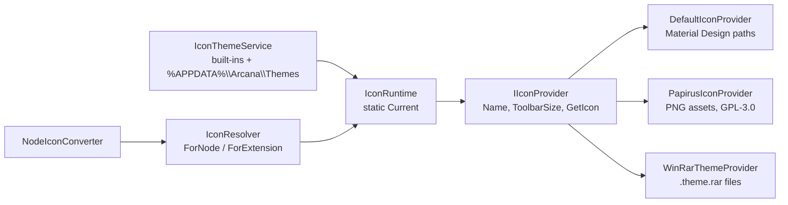

# Architecture

This document describes the current architecture of Arcana as implemented. Diagrams use [Mermaid](https://mermaid.js.org/).

## System Context (C4 Level 1)



## Container Diagram (C4 Level 2)



## Layer Diagram



## Project Structure

```
arcana/
├── src/
│   ├── Arcana.Core/            # Library: engines, VFS, crypto, tools, logging
│   ├── Arcana.Cli/             # CLI: 8 commands, Spectre.Console output
│   └── Arcana.App/             # Avalonia GUI: MVVM, services, controls
├── tests/
│   ├── Arcana.Core.Tests/      # 134 tests (engines, crypto, tools, factory)
│   └── Arcana.App.Tests/       # 11 tests (headless Avalonia, binding/VM tests)
├── docs/                       # This documentation set
└── build/                      # clean.ps1, increment-version.ps1
```

Solution file: `src/Arcana.slnx` (Core, Cli, App, Mobile placeholder, Core.Tests, App.Tests).

## Core Class Diagram



### Engine Matrix



## Open Pipeline (browse / extract / preview)



Format detection (`GetFormatFromPathOrHeader`) checks the extension first, then the first 8 bytes. When a native engine cannot open a stream, the Hawkynt `FormatRegistry` is tried as a last resort — this is how MSIX, MSI, EXE/SFX, CHM, WIM, game packs and other hidden archive formats are read.

## Compress Pipeline



Only `ZipEngine` and `SevenZipEngine` support writing encrypted archives (via the Arcana crypto stream wrapper). `AceEngine`/`ArjEngine` accept a password that is forwarded to the underlying reader. Reading encrypted archives unwraps with `CreateDecryptingStream` (see [CIPHERS.md](compression/CIPHERS.md)).

## GUI Architecture



- **MVVM**: CommunityToolkit.Mvvm source generators (`[ObservableProperty]`, `[RelayCommand]`). No ReactiveUI.
- **DI**: Microsoft.Extensions.DependencyInjection — services registered as singletons, ViewModels as transients (`App.axaml.cs`).
- **Compiled bindings**: `x:DataType` enabled project-wide; converters (Equals, Invert) registered in `App.axaml`.
- **Threading**: all UI work on `Dispatcher.UIThread`; background work via `Task.Run` (`RunBusyAsync`) + `IProgress<T>`.

### Preview pipeline



## Icon Architecture



## Technology Stack

| Layer | Technology | Version |
|---|---|---|
| Runtime | .NET | 10.0 (C# 12/13) |
| UI Framework | Avalonia UI | 12.1 |
| DataGrid | Avalonia.Controls.DataGrid | 12.1 |
| MVVM | CommunityToolkit.Mvvm | 8.4 |
| DI | Microsoft.Extensions.DependencyInjection | 10.0 |
| CLI Parser | System.CommandLine | 2.0.10 |
| Console UI | Spectre.Console | 0.57.2 |
| Compression | SharpCompress | 0.50.1 |
| Zstandard | ZstdNet | 1.5.7 |
| LZ4 | K4os.Compression.LZ4 | 1.3.8 |
| Snappy | Snappy.Sharp | 1.0.0 |
| Legacy fallback | Hawkynt.FileFormats.Archives | 1.0.0.696 |
| Argon2 | Konscious.Security.Cryptography.Argon2 | 1.3.1 |
| Logging | Serilog | 4.4.0 |
| Testing | xUnit + FluentAssertions | Latest |

## Platform Support

| Platform | Desktop | Mobile |
|---|---|---|
| Windows 10/11 | ✅ Native | N/A |
| macOS (Intel + Apple Silicon) | ✅ Native (Avalonia) | N/A |
| Linux (GNOME, KDE, etc.) | ✅ Native (Avalonia) | N/A |
| iOS / Android | ❌ | Planned (Avalonia) |

## Threading Model

- **I/O and compression**: async streams + `Task.Run` in engines; `CancellationToken` through the pipeline.
- **UI**: always `Dispatcher.UIThread`; long operations via `RunBusyAsync` (status bar progress).
- **Logging**: Serilog console + rolling file sink (`%AppData%\Arcana\logs\arcana-*.log`).
