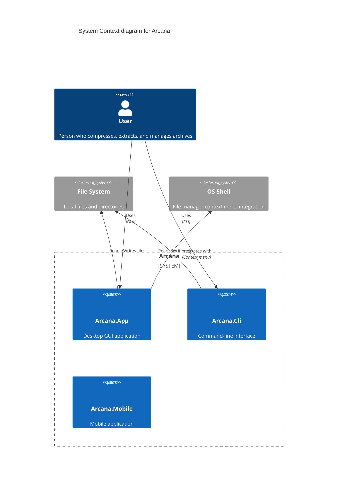
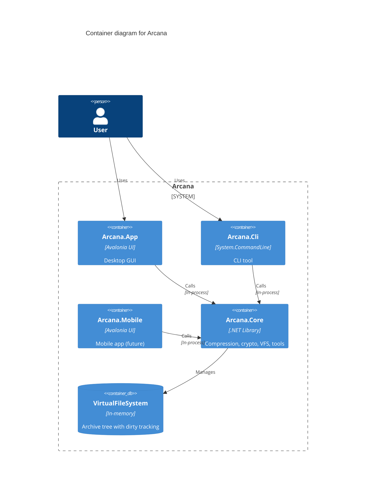
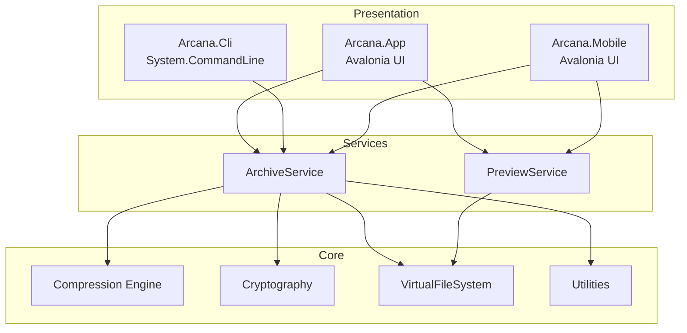
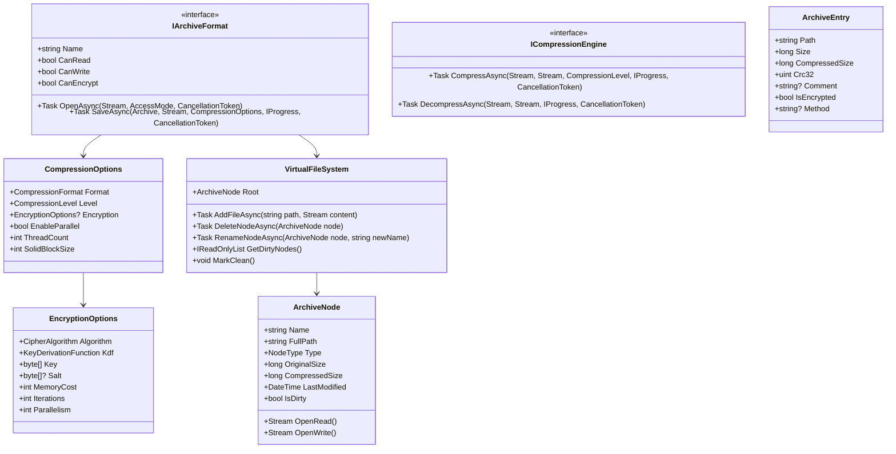
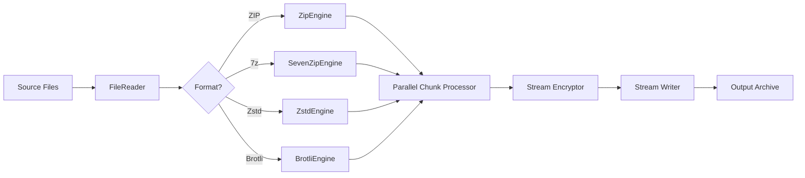
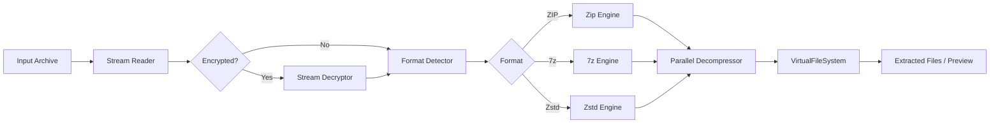

# Architecture

## System Context (C4 Level 1)

## Container Diagram (C4 Level 2)

## Layer Diagram

## Class Diagram (Core)

## Compression Pipeline

## Decompression Pipeline

## Technology Stack

| Layer | Technology | Version |
|---|---|---|
| Runtime | .NET | 8.0 |
| UI Framework | Avalonia UI | 11.x |
| MVVM | CommunityToolkit.Mvvm | 8.4+ |
| DI | Microsoft.Extensions.DependencyInjection | 8.0 |
| CLI Parser | System.CommandLine | 2.0+ |
| Compression | SharpCompress | 0.38+ |
| Zstandard | ZstdNet | 1.5+ |
| Cryptography | System.Security.Cryptography | Built-in |
| Argon2 | Konscious.Security.Cryptography.Argon2 | 1.3+ |
| Image Processing | SixLabors.ImageSharp | 3.1+ |
| Testing | xUnit + FluentAssertions | Latest |

## Platform Support

| Platform | Desktop | Mobile (future) |
|---|---|---|
| Windows 10/11 | ✅ Native | N/A |
| macOS (Intel + Apple Silicon) | ✅ Native | N/A |
| Linux (GNOME, KDE, etc.) | ✅ Native | N/A |
| iOS | ❌ | ✅ Planned |
| Android | ❌ | ✅ Planned |

## Threading Model

- **Compression/Decompression**: Parallel.ForEach with configurable degree of parallelism
- **UI**: Always on Dispatcher.UIThread; background work via `Task.Run` + `IProgress<T>`
- **Cancellation**: `CancellationToken` through entire pipeline
- **I/O**: Async file streams with `ConfigureAwait(false)` in library code
