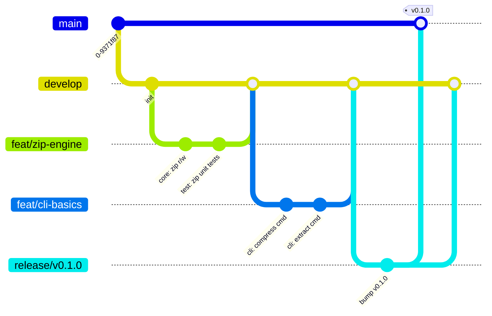

# Branch Strategy

## Model



## Branch Purpose

| Branch | Base | Merge Target | Lifetime | Purpose |
|---|---|---|---|---|
| `main` | — | — | Permanent | Latest stable release |
| `develop` | `main` | `main` | Permanent | Integration branch for features |
| `feat/*` | `develop` | `develop` | Short | New features |
| `fix/*` | `develop` | `develop` | Short | Bug fixes |
| `release/*` | `develop` | `main` + `develop` | Short | Release preparation |
| `hotfix/*` | `main` | `main` + `develop` | Short | Emergency fixes on stable |

## Naming Conventions

```
feat/<short-description>     # feat/zip-engine, feat/aes-gcm
fix/<short-description>      # fix/memory-leak, fix/utf8-paths
release/v<major>.<minor>.<patch>  # release/v0.1.0
hotfix/v<major>.<minor>.<patch>-<description>  # hotfix/v0.1.1-crash-fix
chore/<description>          # chore/update-deps, chore/ci-cache
docs/<description>           # docs/architecture, docs/readme
```

## Workflow

### Feature Development

```shell
git checkout develop
git pull
git checkout -b feat/my-feature
# work, commit, push
git checkout develop
git merge feat/my-feature --squash
git branch -D feat/my-feature
```

### Bug Fixes

```shell
git checkout develop
git checkout -b fix/my-bug
# work, commit, push
git checkout develop
git merge fix/my-bug --squash
git branch -D fix/my-bug
```

### Release

```shell
git checkout develop
git checkout -b release/v0.1.0
# bump versions, update changelog
git commit -m "release: v0.1.0"
git checkout main
git merge release/v0.1.0 --no-ff
git tag -s v0.1.0
git checkout develop
git merge release/v0.1.0 --no-ff
git branch -D release/v0.1.0
```

### Hotfix

```shell
git checkout main
git checkout -b hotfix/v0.1.1-sec-fix
# fix, commit, bump version
git checkout main
git merge hotfix/v0.1.1-sec-fix --no-ff
git tag -s v0.1.1
git checkout develop
git merge hotfix/v0.1.1-sec-fix --no-ff
git branch -D hotfix/v0.1.1-sec-fix
```

## Commit Convention

[Conventional Commits](https://www.conventionalcommits.org/) strictly enforced:

```
<type>(<scope>): <short description>

[optional body]

[optional footer]
```

| Type | Usage |
|---|---|
| `feat` | New feature |
| `fix` | Bug fix |
| `docs` | Documentation |
| `style` | Formatting only |
| `refactor` | Code change without feature/fix |
| `perf` | Performance improvement |
| `test` | Adding/fixing tests |
| `chore` | Build, CI, deps |
| `release` | Release commit |

## Commit Message Examples

```
feat(core): add ZIP AES-256 encryption support

feat(cli): implement archive list command

fix(core): handle UTF-8 filenames in ZIP headers

docs(architecture): add C4 container diagram

chore(ci): add GitHub Actions release workflow
```

## Branch Protection Rules (GitHub)

### `main`
- Require pull request before merging
- Require status checks (CI build + test)
- Require linear history (no merge commits?)
- No direct pushes

### `develop`
- Require pull request before merging
- Require status checks
- Allow squash merging only
