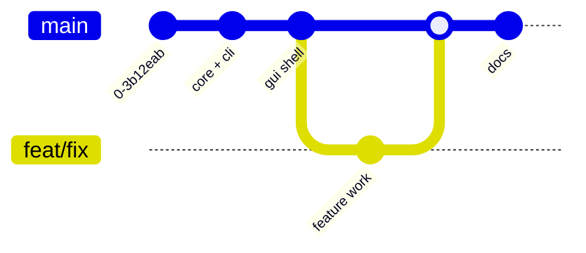

# Branch Strategy

## Model: Trunk-Based with short-lived branches

The repository works directly on `main` (initial history is 4 commits on `main`). `develop`/`release`/`hotfix` branches are **not** used. Keep branches short-lived and small.



## Branch Purpose

| Branch | Base | Merge Target | Lifetime | Purpose |
|---|---|---|---|---|
| `main` | — | — | Permanent | Latest state (stable-ish; single dev) |
| `feat/*` | `main` | `main` | Short | New features |
| `fix/*` | `main` | `main` | Short | Bug fixes |
| `docs/*` | `main` | `main` | Short | Documentation |
| `release/v*` | `main` | `main` | Short | Release preparation (optional) |

## Naming Conventions

```
feat/<short-description>     # feat/archive-editing, feat/chacha20
fix/<short-description>      # fix/utf8-paths, fix/empty-entries
docs/<description>           # docs/architecture, docs/readme
release/v<major>.<minor>.<patch>  # release/v0.1.0
```

## Workflow

```shell
git checkout -b feat/my-feature
# work, commit, push
git checkout main
git pull
git merge feat/my-feature --squash
git branch -D feat/my-feature
```

Always sync with remote before merging. Squash merges keep `main` history linear and readable.

## Commit Convention

[Conventional Commits](https://www.conventionalcommits.org/):

```
<type>(<scope>): <short description>

[optional body]

[optional footer]
```

| Type | Usage |
|---|---|
| `feat` | New feature |
| `fix` | Bug fix |
| `docs` | Documentation |
| `style` | Formatting only |
| `refactor` | Code change without feature/fix |
| `perf` | Performance improvement |
| `test` | Adding/fixing tests |
| `chore` | Build, CI, deps |
| `release` | Release commit |

## Commit Message Examples

```
feat(core): add ZIP AES-256 encryption support

feat(cli): implement archive list command

fix(core): handle UTF-8 filenames in ZIP headers

docs(architecture): add C4 container diagram

chore(ci): add GitHub Actions release workflow
```

## Release

1. Bump version: `powershell -File build/increment-version.ps1`
2. Commit + tag on `main`:

```shell
git tag v0.1.0-build.3 -m "v0.1.0-build.3"
```

## Branch Protection (GitHub, future)

When CI is added (see [ROADMAP](ROADMAP.md)):

- `main`: require CI checks to pass, require PRs for larger changes
- No direct pushes once the team grows
