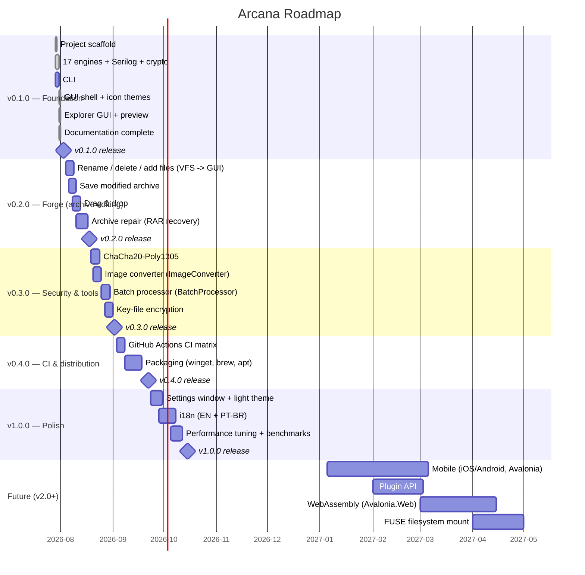
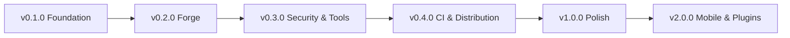

# Roadmap

Status as of 2026-07-31. The core (engines, CLI, GUI) shipped quickly; remaining work is editing, polish, distribution and long-term features.

## Timeline

## Engine Status

| Engine | Backend | R/W | Encrypt | Tests | Status |
|---|---|---|---|---|---|
| Zip | SharpCompress ZipArchive + Arcana AES-GCM | r/w | ✅ | ✅ | stable |
| SevenZip | SharpCompress SevenZipArchive + Arcana AES-GCM | r/w | ✅ | ✅ | stable |
| Zstd | ZstdNet | r/w | — | ✅ | stable |
| Tar (+Gz/Bz2/Xz/Zst) | SharpCompress + routing (Xz write N/S) | r/w | — | ✅ | stable |
| RAR | SharpCompress (RAR4/RAR5) | r/o | — | ✅ | stable |
| ACE | Hawkynt AceFormatDescriptor | r/o | ⚠️ | ✅ | stable |
| ARJ | SharpCompress ArjReader | r/o | ⚠️ | ✅ | stable |
| CAB | Hawkynt CabFormatDescriptor | r/o | — | ✅ | stable |
| LZH/LHA | Hawkynt LzhFormatDescriptor | r/o | — | ✅ | stable |
| Brotli | System.IO.Compression | r/w | — | ✅ | stable |
| GZip | SharpCompress GZipStream | r/w | — | ✅ | stable |
| BZip2 | SharpCompress BZip2Stream | r/w | — | ✅ | stable |
| Xz | SharpCompress LZipStream | r/w | — | ✅ | stable |
| LZMA | SharpCompress LZipStream | r/w | — | ✅ | stable |
| LZ4 | K4os.Compression.LZ4 | r/w | — | ✅ | stable |
| Snappy | Snappy.Sharp | r/w | — | ✅ | stable |
| HawkyntFallback | FormatRegistry auto-detect (240+) | r/o | ⚠️ | ✅ | best-effort |
| **Total** | **17 engines** | | | **145 tests** (134 Core + 11 App) | |

## Milestone Summary

| Milestone | Version | Key Deliverables | Status |
|---|---|---|---|
| Foundation | v0.1.0 | Scaffold, 17 engines, CLI, GUI shell, explorer GUI, docs | ✅ 100% |
| Forge | v0.2.0 | Archive editing, drag & drop, repair | 🔶 0% |
| Security & Tools | v0.3.0 | ChaCha20-Poly1305, image converter, batch processor | 🔶 0% |
| CI & Distribution | v0.4.0 | GitHub Actions, winget/brew/apt | ❌ 0% |
| Polish | v1.0.0 | Settings, themes, i18n, perf | ❌ 0% |
| Mobile | v2.0.0 | iOS/Android, plugins, WASM, FUSE | ❌ 0% |

## Dependency Graph

## Next Steps

1. Wire archive editing (rename/delete/add) from the VFS API into the GUI
2. Save modified archives (in-place and save-copy-as)
3. ChaCha20-Poly1305 implementation
4. GitHub Actions CI
5. Image conversion (unblock `ImageConverter` stub)
