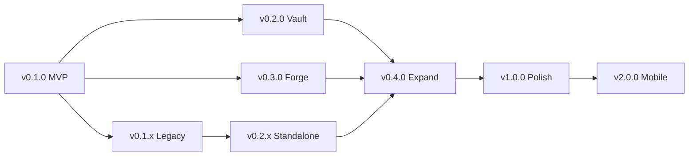

# Roadmap

## Timeline

```mermaid
gantt
    title Arcana Roadmap
    dateFormat  YYYY-MM-DD
    axisFormat  %Y Q%q

    section MVP (v0.1.0)
    Project scaffold               :done, 2026-08-01, 7d
    Core interfaces + models       :done, 2026-08-05, 10d
    ZipEngine (r/w)                :done, 2026-08-12, 14d
    ZstdEngine (r/w)               :done, 2026-08-19, 7d
    SevenZipEngine (r/w)           :done, 2026-08-22, 10d
    TarEngine (r/w)                :done, 2026-08-28, 10d
    CLI: compress, extract, list   :done, 2026-08-28, 10d
    CLI: convert, hash, split, join, benchmark :done, 2026-09-02, 10d
    UI: MainWindow shell           :done, 2026-09-02, 10d
    MVP release                    :milestone, 2026-09-15, 0d

    section Legacy Archives (v0.1.x)
    RAR (read-only)                :done, 2026-09-10, 5d
    ACE, ARJ, CAB, LZH (read-only) :done, 2026-09-12, 10d
    HawkyntFallback (240+ formats) :done, 2026-09-18, 7d
    Legacy test suite (79 tests)   :done, 2026-09-20, 5d

    section Vault (v0.2.0)
    AES-256-GCM encryption         :done, 2026-09-20, 10d
    Argon2id KDF                   :done, 2026-09-25, 5d
    ChaCha20-Poly1305              :active, 2026-10-01, 7d
    CLI encrypt/decrypt flags      :done, 2026-10-05, 5d
    UI: Preview panel              :active, 2026-10-08, 14d
    UI: Password dialogs           :2026-10-15, 5d
    v0.2.0 release                 :milestone, 2026-10-22, 0d

    section Standalone Compressors
    Brotli, GZip, BZip2, Xz, LZMA :done, 2026-10-01, 7d
    LZ4, Snappy                    :done, 2026-10-05, 5d
    Serilog observability          :done, 2026-10-08, 5d

    section Forge (v0.3.0)
    VirtualFileSystem              :done, 2026-10-25, 14d
    File split/join + HJSplit      :done, 2026-11-01, 7d
    Hash calculator                :done, 2026-11-05, 5d
    Edit-in-place (rename/del/add) :2026-11-10, 10d
    UI: Archive editing            :2026-11-15, 10d
    UI: Text file inline editor    :2026-11-20, 7d
    UI: Tools panel                :2026-11-22, 10d
    v0.3.0 release                 :milestone, 2026-11-25, 0d

    section Expand (v0.4.0)
    Image converter                :2026-12-01, 10d
    Batch processor                :2026-12-05, 7d
    UI: Image preview              :2026-12-10, 10d
    UI: Progress panel             :2026-12-15, 7d
    UI: Settings window            :2026-12-18, 7d
    UI: Drag & drop                :2026-12-20, 7d
    Windows shell extension        :2026-12-22, 10d
    v0.4.0 release                 :milestone, 2027-01-05, 0d

    section Polish (v1.0.0)
    GitHub Actions CI matrix       :2027-01-10, 7d
    Theme support (dark/light)     :2027-01-12, 10d
    i18n: EN + PT-BR              :2027-01-15, 14d
    Performance tuning             :2027-01-20, 14d
    Documentation complete         :2027-01-28, 10d
    Package: winget, brew, apt    :2027-02-01, 14d
    v1.0.0 release                 :milestone, 2027-02-15, 0d

    section Future (v2.0+)
    Mobile: iOS head               :2027-03-01, 60d
    Mobile: Android head           :2027-03-01, 60d
    Plugin API                     :2027-04-01, 30d
    WebAssembly (Avalonia.Web)    :2027-05-01, 45d
    FUSE filesystem mount         :2027-06-01, 30d
```

## Engine Status

| Engine | Backend | R/W | Tests | Status |
|---|---|---|---|---|
| Zip | SharpCompress ZipArchive + ZipWriter | r/w | ✅ | stable |
| Zstd | ZstdNet | r/w | ✅ | stable |
| 7-Zip | SharpCompress SevenZip | r/w | ✅ | stable |
| Tar (+Gz/Bz2/Xz/Zst) | SharpCompress Tar + routing | r/w | ✅ | stable |
| RAR | SharpCompress RarArchive | r/o | ✅ | stable |
| ACE | Hawkynt AceFormatDescriptor | r/o | ✅ | stable |
| ARJ | SharpCompress ArjReader | r/o | ✅ | stable |
| CAB | Hawkynt CabFormatDescriptor | r/o | ✅ | stable |
| LZH/LHA | Hawkynt LzhFormatDescriptor | r/o | ✅ | stable |
| Brotli | System.IO.Compression | r/w | — | stable |
| GZip | SharpCompress GZip | r/w | — | stable |
| BZip2 | SharpCompress BZip2 | r/w | — | stable |
| Xz | SharpCompress Xz | r/w | — | stable (write N/S) |
| LZMA | SharpCompress LZMA | r/w | — | stable (write N/S) |
| LZ4 | K4os.Compression.LZ4 | r/w | — | stable |
| Snappy | Snappy.Sharp | r/w | — | stable |
| HawkyntFallback | FormatRegistry auto-detect | r/o | ✅ | stable |
| **Total** | **17 engines** | | **137 tests** | |

## Milestone Summary

| Milestone | Version | Key Deliverables | Status |
|---|---|---|---|
| MVP | v0.1.0 | Core interfaces, 4 engines, CLI, UI shell | ✅ 95% |
| Legacy Archives | v0.1.x | RAR, ACE, ARJ, CAB, LZH, HawkyntFallback | ✅ 100% |
| Vault | v0.2.0 | Encryption, KDF, ChaCha20, preview panel | 🔶 70% |
| Standalone Compressors | v0.2.x | Brotli/GZip/BZip2/Xz/LZMA/LZ4/Snappy + Serilog | ✅ 100% |
| Forge | v0.3.0 | VFS, edit-in-place, split/join, hash, UI tools | 🔶 50% |
| Expand | v0.4.0 | Image, batch, preview, settings, drag & drop, shell ext | 🔶 5% |
| Polish | v1.0.0 | CI/CD, themes, i18n, perf, packages | ❌ 0% |
| Mobile | v2.0.0 | iOS/Android, plugins, WASM, FUSE | ❌ 0% |

## Dependency Graph



## Next Steps

1. Wire Avalonia UI: open → browse → extract → preview
2. GitHub Actions CI
3. ChaCha20-Poly1305 implementation
4. Image preview + conversion (SixLabors.ImageSharp)
5. Settings window + theme toggle
