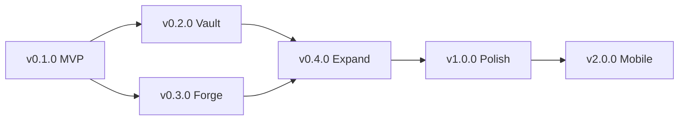

# Roadmap

## Timeline

```mermaid
gantt
    title Arcana Roadmap
    dateFormat  YYYY-MM-DD
    axisFormat  %Y Q%q

    section MVP (v0.1.0)
    Project scaffold & CI           :done, 2026-08-01, 7d
    Core: Compression interfaces    :done, 2026-08-05, 10d
    Core: ZipEngine (r/w)          :done, 2026-08-12, 14d
    Core: ZstdEngine (read)        :done, 2026-08-19, 7d
    Core: SevenZipEngine (read)    :done, 2026-08-22, 10d
    CLI: compress, extract, list   :done, 2026-08-28, 10d
    UI: MainWindow shell           :done, 2026-09-02, 10d
    UI: Archive browser (read)     :done, 2026-09-08, 10d
    UI: Extract dialog             :done, 2026-09-12, 7d
    MVP release                    :milestone, 2026-09-15, 0d

    section Vault (v0.2.0)
    Core: SevenZipEngine (write)   :active, 2026-09-20, 10d
    Core: ZstdEngine (write)       :active, 2026-09-25, 7d
    Core: AES-GCM encryption       :active, 2026-10-01, 10d
    Core: Argon2id KDF             :active, 2026-10-05, 5d
    Core: ChaCha20-Poly1305        :active, 2026-10-08, 7d
    UI: Preview panel (text + hex) :active, 2026-10-10, 14d
    UI: Password dialogs           :active, 2026-10-15, 5d
    CLI: encrypt/decrypt flags     :active, 2026-10-18, 5d
    v0.2.0 release                 :milestone, 2026-10-22, 0d

    section Forge (v0.3.0)
    Core: VirtualFileSystem        :2026-10-25, 14d
    Core: Edit-in-place (rename/del/add) :2026-11-01, 10d
    Core: File split/join          :2026-11-05, 7d
    Core: Hash calculator          :2026-11-08, 5d
    UI: Archive editing (tree ops) :2026-11-10, 10d
    UI: Text file inline editor    :2026-11-15, 7d
    UI: Tools panel                :2026-11-18, 10d
    CLI: split, join, hash cmds    :2026-11-20, 5d
    v0.3.0 release                 :milestone, 2026-11-25, 0d

    section Expand (v0.4.0)
    Core: Image converter          :2026-12-01, 10d
    Core: Batch processor          :2026-12-05, 7d
    Core: Brotli, LZ4, LZMA, XZ   :2026-12-08, 14d
    UI: Image preview              :2026-12-10, 7d
    UI: Progress panel             :2026-12-12, 7d
    UI: Settings window            :2026-12-15, 7d
    UI: Drag & drop                :2026-12-18, 7d
    Windows shell extension        :2026-12-20, 10d
    v0.4.0 release                 :milestone, 2027-01-05, 0d

    section Polish (v1.0.0)
    Theme support (dark/light)     :2027-01-10, 10d
    i18n: EN + PT-BR              :2027-01-15, 14d
    Performance tuning             :2027-01-20, 14d
    CI/CD: GitHub Actions matrix   :2027-01-25, 7d
    Documentation complete         :2027-01-28, 10d
    Package: winget, brew, apt    :2027-02-01, 14d
    v1.0.0 release                 :milestone, 2027-02-15, 0d

    section Future (v2.0+)
    Mobile: iOS head               :2027-03-01, 60d
    Mobile: Android head           :2027-03-01, 60d
    Plugin API                     :2027-04-01, 30d
    WebAssembly (Avalonia.Web)    :2027-05-01, 45d
    FUSE filesystem mount         :2027-06-01, 30d
```

## Milestone Summary

| Milestone | Version | Key Deliverables | Target |
|---|---|---|---|
| MVP | v0.1.0 | Core interfaces, ZIP r/w, Zstd r/o, 7z r/o, CLI (compress/extract/list), UI shell + archive browser | 2026-09-15 |
| Vault | v0.2.0 | 7z write, Zstd write, AES-GCM, ChaCha20-Poly1305, Argon2id, preview panel | 2026-10-22 |
| Forge | v0.3.0 | Virtual File System, edit-in-place, file split/join, hash, text editor | 2026-11-25 |
| Expand | v0.4.0 | Image conversion, batch processing, Brotli/LZ4/LZMA/XZ, drag & drop, shell extension | 2027-01-05 |
| Polish | v1.0.0 | Themes, i18n, performance, CI/CD, packages | 2027-02-15 |
| Mobile | v2.0.0 | iOS + Android heads, plugin API | 2027-Q2 |

## Dependencies Between Milestones


