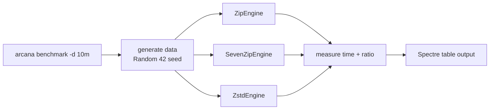

# Benchmarks

How to benchmark Arcana, and what the current results mean.

## The `benchmark` command

```shell
arcana benchmark [-d <data>]
```

Benchmarks the **ZIP, 7z and Zstandard** engines against synthetic data. Current behavior:

- `--data` / `-d` selects the payload size: `tiny`, `1k`, `small`, `1m`, `medium`, `10m` (default `tiny`).
- Data is generated deterministically with a fixed random seed (`Random(42)`), so runs are reproducible.
- Reports per-format throughput and ratio.
- Returns exit code 0.



## Methodology (proposed for formal results)

When producing official numbers for the docs or release notes:

1. Run every scenario 3 times; report the median.
2. Skip the first (warm-up) run.
3. Record: compression ratio, wall-clock time, peak memory, CPU utilization.
4. Use real corpora when available: Silesia (~202 MB), `enwik8` (~100 MB), a Linux kernel tree, a photo set (JPEG, incompressible), and random data for throughput ceiling.
5. Keep a fixed hardware reference (CPU / RAM / storage / OS) so results are comparable across releases.

## Current Snapshot (informal)

No official numbers have been captured yet for this repository. Run `arcana benchmark -d 10m` on your machine and note:

- ZIP (Deflate) — the compatibility baseline.
- 7z (LZMA2) — best ratio in this set, slowest writer.
- Zstd — best speed/ratio balance, strong at high levels.

## Typical Expectations

| Format | Speed | Ratio | Notes |
|---|---|---|---|
| LZ4 / Snappy | fastest | lowest | throughput-bound use cases |
| Zstd | fast | good | sweet spot for most users |
| ZIP | moderate | moderate | universal compatibility |
| Brotli | moderate | good on text | strong for text payloads |
| 7z / LZMA / XZ | slowest | best | maximum compression |
| BZip2 | slow | good | legacy choice |

## How to Contribute Results

1. Add a section in this file with your hardware table (CPU, RAM, storage, OS).
2. Run `arcana benchmark -d 10m` (and optionally `-d tiny`).
3. Paste the output table with the date and Arcana version (`arcana --version`).
