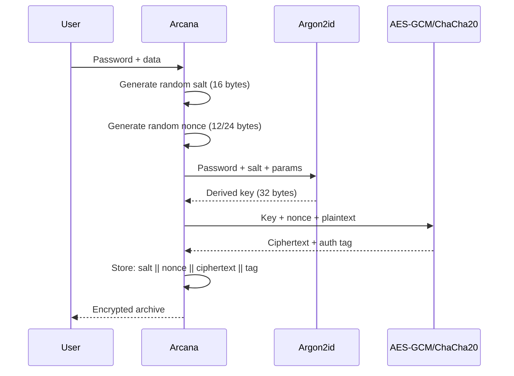
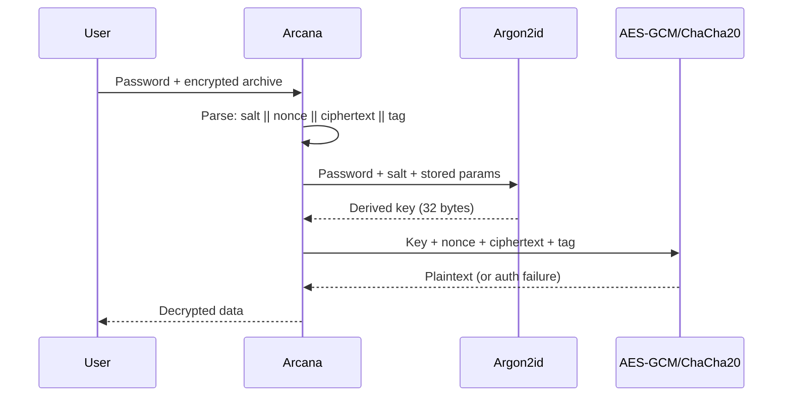

# Encryption Algorithms

## Design Principles

1. **Authenticated Encryption (AEAD)** — all encryption provides confidentiality + integrity + authenticity
2. **Memory-Hard KDF** — password-based keys derived via Argon2id (not PBKDF2)
3. **Random Salt + Nonce** — unique per encryption operation
4. **Forward Secrecy** — via ephemeral key exchange where applicable

## Cipher Algorithms

### AES-256-GCM (Default)

| Property | Value |
|---|---|
| Algorithm | AES-256 in GCM mode |
| Key size | 256 bits |
| Nonce size | 96 bits (12 bytes) |
| Tag size | 128 bits (16 bytes) |
| Auth data | Filename + uncompressed size (optional) |
| Hardware acceleration | AES-NI on x64, ARMv8 Crypto Extensions |
| Status | ✅ Default |

**When to use**: General purpose. Fast with hardware acceleration. Most compatible.

### ChaCha20-Poly1305

| Property | Value |
|---|---|
| Algorithm | ChaCha20 stream cipher + Poly1305 MAC |
| Key size | 256 bits |
| Nonce size | 96 bits (12 bytes) / XChaCha20: 192 bits (24 bytes) |
| Tag size | 128 bits (16 bytes) |
| Auth data | Filename + uncompressed size (optional) |
| Hardware acceleration | Software (fast on all platforms without AES-NI) |
| Status | ✅ Available |

**When to use**: Mobile/ARM devices. Platforms without AES hardware acceleration. When constant-time execution is critical.

### Comparison

| Property | AES-256-GCM | ChaCha20-Poly1305 |
|---|---|---|
| Software speed | ~3 GB/s (with AES-NI) | ~2 GB/s |
| Hardware required | AES-NI for speed | None |
| Mobile performance | Good (ARMv8 Crypto) | Excellent |
| Security margin | Excellent | Excellent |
| Side-channel resistance | Good (hardware) | Excellent (software, constant-time) |

## Key Derivation

### Argon2id (Default)

| Property | Value |
|---|---|
| Algorithm | Argon2id (hybrid: data-dependent + data-independent) |
| Default memory | 64 MB |
| Default iterations | 3 |
| Default parallelism | 4 threads |
| Output length | 32 bytes (256 bits) |
| Salt length | 16 bytes (random) |
| Status | ✅ Default |

**Memory and time parameters are stored in the archive header**, allowing future increases without breaking backward compatibility.

### Parameter Selection Guide

| Sensitivity | Memory | Iterations | Parallelism | Time estimate (4-core) |
|---|---|---|---|---|
| Low (casual) | 16 MB | 2 | 2 | ~0.3s |
| Medium (default) | 64 MB | 3 | 4 | ~1.5s |
| High (sensitive) | 256 MB | 4 | 8 | ~6s |
| Paranoid | 1 GB | 5 | 16 | ~30s |

## Key File Support (future)

Key files are treated as raw entropy sources:

- Minimum 32 bytes of entropy
- Hashed with BLAKE2b-256 before use
- Can be combined with password (both required, XORed)

## Encryption Workflow

## Decryption Workflow

## Encryption Overhead

Per encrypted file/entry:

| Component | Size |
|---|---|
| Salt | 16 bytes |
| Nonce | 12-24 bytes |
| Auth tag | 16 bytes |
| KDF params | ~8 bytes |
| **Total overhead** | **~52-64 bytes per entry** |

## Security Warnings

1. **Passwords are the weakest link**. Use a password manager to generate random 20+ character passwords
2. **Arcanum does NOT support "repairing" or "recovering" passwords**
3. **Auth tag verification is mandatory** — tampered ciphertext is detected and rejected
4. **Metadata (file names, sizes, dates) is encrypted** in 7z and Arcana container, but NOT in ZIP (ZIP header metadata is visible even with encryption)
