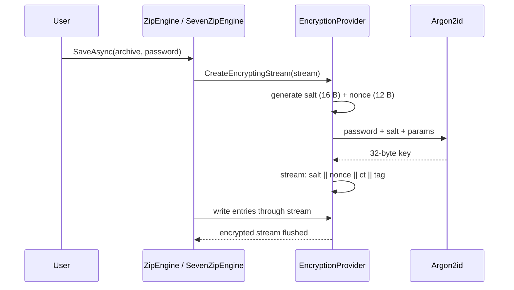
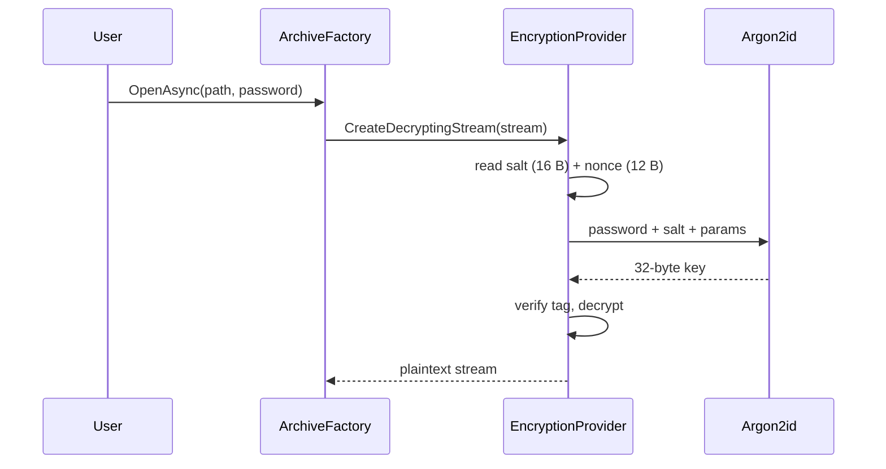

# Encryption & Key Derivation

How Arcana protects archives today, plus what is planned.

## Design Principles

1. **Authenticated Encryption (AEAD)** — confidentiality + integrity + authenticity in one primitive (AES-256-GCM).
2. **Memory-Hard KDF** — passwords are derived with Argon2id, not PBKDF2.
3. **Random Salt per operation** — a fresh 16-byte salt is generated and embedded in the encrypted stream.

## Current Implementation

| Component | Value |
|---|---|
| Cipher | AES-256-GCM (`System.Security.Cryptography.AesGcm`) |
| Key size | 256 bits |
| Nonce size | 96 bits (12 bytes), random per operation |
| Auth tag | 128 bits (16 bytes) |
| KDF | Argon2id (Konscious) |
| KDF defaults | 64 MB memory, 3 iterations, 4 parallelism |
| Salt | 16 bytes, random, embedded at stream start |
| Stream API | `EncryptionProvider.CreateEncryptingStream` / `CreateDecryptingStream` |

### On-disk layout (Arcana-encrypted stream)

```
┌────────┬─────────┬──────────────────────┬────────┐
│ salt   │ nonce   │ ciphertext (GCM)     │ tag    │
│ 16 B   │ 12 B    │ ...                  │ 16 B   │
└────────┴─────────┴──────────────────────┴────────┘
```

The salt is prepended when the key is derived from a password. Encryption and decryption are whole-buffer operations (buffered, encrypted/decrypted on completion).

### Scope

- **Writers**: only `ZipEngine` and `SevenZipEngine` can produce encrypted archives (they wrap the output stream with `EncryptStream`).
- **Readers**: `ArchiveFactory.SetPassword` forwards the password to Zip, SevenZip, Zstd, Rar, Ace, Arj, Cab, Lzh and the Hawkynt fallback. ZIP/7z decrypt via `DecryptStream`; RAR/ACE/ARJ/CAB/LZH decrypt natively via the underlying reader.
- **Interop**: encryption uses Arcana's own container format. **Archives encrypted with Arcana can only be decrypted by Arcana.**

## Encryption Workflow (write)



## Decryption Workflow (read)



## Key Derivation Parameters

| Parameter | Default | Notes |
|---|---|---|
| Memory | 64 MB | `KdfMemoryMB` in `EncryptionOptions` |
| Iterations | 3 | `KdfIterations` |
| Parallelism | 4 | `KdfParallelism` |

Parameters are part of `EncryptionOptions`; raising them hardens against GPU/ASIC brute force at the cost of KDF time.

## Planned

| Feature | Status |
|---|---|
| ChaCha20-Poly1305 | ❌ Enum value exists (`CipherAlgorithm.ChaCha20Poly1305`), no implementation. Target: mobile/ARM without AES hardware acceleration |
| Key files | ❌ Design: raw entropy source, min 32 bytes, combined with password |
| Parameter storage in archive header | ❌ Currently parameters are negotiated by `EncryptionOptions`, not stored per-archive |

## Security Notes

1. **Passwords are the weakest link.** Use a password manager; prefer long random passwords.
2. **No password recovery.** Arcana cannot repair or recover lost passwords.
3. **Tag verification is mandatory.** Tampered ciphertext fails authentication and is rejected.
4. **Metadata exposure.** Encryption wraps the compressed stream. Container-level metadata (ZIP entry names) may remain visible; ZIP headers are not fully hidden.
5. **`SecureString` note.** Passwords currently flow as `string` through `EncryptionOptions`/engine `Password`. Zeroing sensitive buffers is planned hardening.
