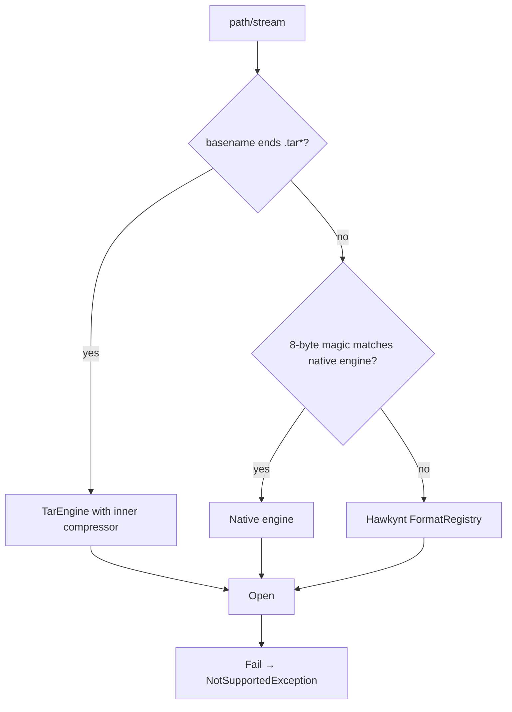

# Supported Compression Formats

Capability matrix for all 17 engines. Detection is done by magic bytes first, then extension — so formats are recognized by content, not by name.

## Capability Matrix

| Format | Read | Write | Encrypt | Solid | Volumes | Backend |
|---|---|---|---|---|---|---|
| ZIP | ✅ | ✅ | ✅ | ❌ | ❌ | SharpCompress |
| 7z | ✅ | ✅ | ✅ | ⚠️ (declared) | ⚠️ (declared) | SharpCompress |
| Zstandard (`.zst`) | ✅ | ✅ | ❌ | ❌ | ❌ | ZstdNet |
| Tar (`.tar`) | ✅ | ✅ | ❌ | ❌ | ❌ | SharpCompress |
| Tar+Gzip (`.tar.gz`, `.tgz`) | ✅ | ✅ | ❌ | ❌ | ❌ | TarEngine routing |
| Tar+BZip2 (`.tar.bz2`) | ✅ | ✅ | ❌ | ❌ | ❌ | TarEngine routing |
| Tar+XZ (`.tar.xz`) | ✅ | ⚠️ write throws `NotSupportedException` | ❌ | ❌ | ❌ | TarEngine routing |
| Tar+Zstd (`.tar.zst`) | ✅ | ✅ | ❌ | ❌ | ❌ | TarEngine + ZstdNet |
| GZip (`.gz`) | ✅ | ✅ | ❌ | ❌ | ❌ | SharpCompress |
| BZip2 (`.bz2`) | ✅ | ✅ | ❌ | ❌ | ❌ | SharpCompress |
| XZ (`.xz`) | ✅ | ✅ | ❌ | ❌ | ❌ | SharpCompress |
| LZMA (`.lzma`) | ✅ | ✅ | ❌ | ❌ | ❌ | SharpCompress |
| Brotli (`.br`) | ✅ | ✅ | ❌ | ❌ | ❌ | System.IO.Compression |
| LZ4 (`.lz4`) | ✅ | ✅ | ❌ | ❌ | ❌ | K4os.Compression.LZ4 |
| Snappy (`.snappy`) | ✅ | ✅ | ❌ | ❌ | ❌ | Snappy.Sharp |
| RAR (`.rar`, RAR4+RAR5) | ✅ | ❌ | ⚠️ decrypt | ✅ | ✅ | SharpCompress |
| ACE (`.ace`) | ✅ | ❌ | ⚠️ password | — | — | Hawkynt |
| ARJ (`.arj`) | ✅ | ❌ | ⚠️ password | — | — | SharpCompress |
| CAB (`.cab`) | ✅ | ❌ | ❌ | — | ✅ | Hawkynt |
| LZH / LHA (`.lzh`) | ✅ | ❌ | ❌ | — | — | Hawkynt |
| 240+ fallback formats | ✅ best-effort | ❌ | ⚠️ password | — | — | Hawkynt FormatRegistry |

> **Encryption caveat**: "Encrypt ✅" on ZIP/7z means Arcana's own AES-256-GCM stream wrapper — such archives are readable only by Arcana, not by WinZip/7-Zip. "⚠️ password" on read-only formats means a password is forwarded to the underlying reader for decryption.

## Format Details

### ZIP

| Property | Value |
|---|---|
| Read / Write | ✅ Full |
| Encryption | ✅ Arcana AES-256-GCM container |
| Unicode | ✅ UTF-8 |
| Max file size | ZIP64 (practical limit: filesystem) |
| Backend | SharpCompress ZipArchive / ZipWriter |
| Notes | Default CLI output format |

### 7z

| Property | Value |
|---|---|
| Read / Write | ✅ Full |
| Encryption | ✅ Arcana AES-256-GCM container |
| Solid / Volumes | ⚠️ Declared by engine; exercised primarily through `convert` |
| Unicode | ✅ |
| Backend | SharpCompress SevenZipArchive |

### Zstandard

| Property | Value |
|---|---|
| Read / Write | ✅ Full |
| Encryption | ❌ (Arcana container can be layered by tools) |
| Backend | ZstdNet (native zstd) |
| Notes | Good speed/ratio balance |

### TAR family

| Property | Value |
|---|---|
| Read / Write | ✅ (`.tar.xz` write throws `NotSupportedException`) |
| Routing | Detected when the basename ends with `.tar` — the inner compressor is chosen by suffix |
| Backend | SharpCompress TarArchive + GZip/BZip2/XZ/Zstd unwrap/wrap |
| Notes | TAR itself stores no compression; always combined with a stream compressor |

### Standalone stream formats

GZip, BZip2, XZ, LZMA, Brotli, LZ4, Snappy — single-stream compressors. Write support is implemented for all seven (XZ/LZMA via SharpCompress `LZipStream`).

### Legacy read-only

RAR (SharpCompress, RAR4+RAR5), ACE, CAB, LZH/LHA (Hawkynt descriptors), ARJ (SharpCompress). Writes throw `NotSupportedException`.

## Hidden Archive Formats (Hawkynt Fallback)

The fallback engine uses `FormatRegistry` to auto-detect archives by magic bytes — including formats whose extensions look nothing like archives:

| Category | Examples |
|---|---|
| Windows packages | MSIX, APPX, MSI, ESD (update), WIM (imaging) |
| Self-extracting / installers | EXE (SFX, NSIS, Inno Setup, UPX, packers) |
| Office & docs | DOCX, XLSX, PPTX, ODT, ODS, ODP, VSDX, EPUB, CBZ, CBR, CHM, MAFF |
| Mobile / Java / .NET | APK, APK native libs, AAB, IPA, JAR, WAR, EAR, XPI, NUPKG, ZIP-based Android OTA |
| Linux | DEB, RPM, AppImage, Snap, SquashFS, CPIO, AR, RPM |
| Email & encoding | TNEF (`winmail.dat`), YEnc, UUencode, BinHex, MacBinary |
| Games | PAK, WAD, MPQ, VPK, Unreal PAK, BSA, RGSS, PSARC, U8, NARC, NDS, Big, Gob, Hog, Grp, Mix, RPA, SARC, VPP, YPF |
| Legacy / retro | ARC, Zoo, SIT, SITX, SQX, UHARC, FreeArc, HA, Kwaj, DMS, Compact Pro, DiskDoubler, PackIt, PowerPacker, Freeze, LhF |
| Streams | ZPAQ, PAQ8, LZOP, LRZIP, LZIP, LZHAM, LZFSE, ZLIB, Lizard, LZS, LZX, BALZ, BCM, CMIX, CRUNCH, DENSITY, QuickLZ, RefPack, RNC, RZIP |

> **Best-effort**: these descriptors come from the Hawkynt library. Quality varies per format; treat them as read-only extras, not guarantees. See `src/Arcana.Core/Compression/Formats/HawkyntFallbackEngine.cs`.

## Compression Level Mapping

`CompressionLevel` enum (0–10):

| Value | Name | Meaning |
|---|---|---|
| 0 | Store | No compression (copy) |
| 1 | Fastest | Fastest |
| 3 | Fast | Fast |
| 5 | Normal | Default |
| 7 | Maximum | Maximum |
| 9 | Ultra | Ultra |
| 10 | Insane | Highest (extreme) |

The CLI clamps user input to 0–9 (compress) / 0–10 (convert). The GUI offers presets 0–9.

## Detection Order

