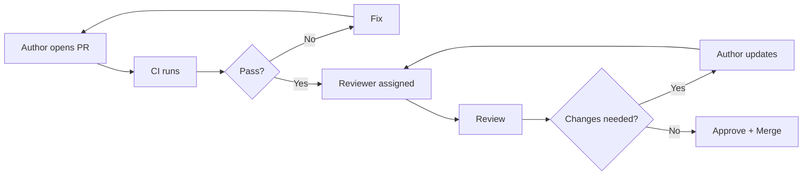

# Code Review Guide

## Review Checklist

### Correctness

- [ ] Does the code satisfy the requirements?
- [ ] Are edge cases handled (empty archives, corrupted data, large files)?
- [ ] Are cancellation tokens properly propagated?
- [ ] Are streams disposed correctly (even on error)?
- [ ] Is async/await used correctly (no sync-over-async)?
- [ ] Are null checks in place for public API parameters?

### Performance

- [ ] Is there any unnecessary memory allocation?
- [ ] Are large objects handled without excessive copying?
- [ ] Is parallel work correctly bounded (`MaxDegreeOfParallelism`)?
- [ ] Are `Span<T>` or `Memory<T>` used where appropriate?
- [ ] Is `ConfigureAwait(false)` used in library code?

### Security

- [ ] Are passwords/keys stored in `SecureString` or `byte[]` (not `string`)?
- [ ] Is sensitive data zeroed after use?
- [ ] Are encryption parameters included in the auth tag?
- [ ] Is input validation in place for paths and filenames?
- [ ] Is there path traversal protection? (no `../` in entry names)

### Style

- [ ] Follows coding standards (see CODING_STANDARDS.md)
- [ ] Meaningful names (no abbreviations beyond well-known)
- [ ] XML doc comments on all public API
- [ ] No commented-out code
- [ ] No `TODO` without an issue reference

### Testing

- [ ] Unit tests cover new code
- [ ] Roundtrip tests for compression
- [ ] Edge cases tested (large files, special chars, empty archives)
- [ ] Golden file tests updated if format changed

## Review Process



## What to Look For in Each Layer

### Core (`Arcana.Core`)

- Interface contracts preserved
- Thread safety (immutable where possible)
- No dependency on UI or CLI types
- Proper stream lifecycle management

### CLI (`Arcana.Cli`)

- Exit codes match documented values
- Error messages are actionable
- Help text is complete and accurate
- Argument validation before calling Core

### UI (`Arcana.App`)

- No business logic in code-behind
- ViewModels testable without UI
- Bindings use compiled bindings (`x:DataType`)
- UI thread not blocked

## Review Speed Expectations

| PR Size | Expected Review Turnaround |
|---|---|
| < 200 lines | < 24 hours |
| 200-500 lines | < 48 hours |
| 500+ lines | < 72 hours (consider splitting) |

## Merge Requirements

- [ ] At least 1 approval
- [ ] All CI checks pass
- [ ] No merge conflicts
- [ ] Branch up to date with `develop`
- [ ] Commit messages follow convention

## License Header (for new files)

For new C# files in `src/`:

```csharp
// Copyright (C) 2024 Marcelo Frau
// SPDX-License-Identifier: GPL-3.0-or-later
```
