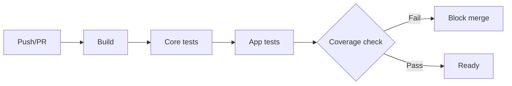

# Testing Strategy

## Test Levels

| Level | Framework | Location | Count |
|---|---|---|---|
| Unit / integration (Core) | xUnit + FluentAssertions | `tests/Arcana.Core.Tests` | 134 |
| UI (headless Avalonia) | xUnit + FluentAssertions | `tests/Arcana.App.Tests` | 11 |
| **Total** | | | **145** |

`tests/Arcana.App.Tests/AssemblyInfo.cs` disables parallelization (Avalonia headless must run sequentially).

## Core Tests (134)

Cover:

- All 17 engines: round-trip compression/extraction, entry metadata, password handling, write-unsupported formats throwing `NotSupportedException`
- `ArchiveFactory`: magic-byte detection, extension detection, tar routing, Hawkynt fallback, `SetPassword`
- `VirtualFileSystem`: tree building, `ChildFolders`, dirty tracking, `FindNode`, `SyncNodeMetadata`
- Cryptography: `EncryptionProvider` encrypt/decrypt round-trip, tamper detection, salt handling, `Argon2KeyDerivation`
- Tools: `FileSplitter`/`FileJoiner` (HJSplit naming, auto-discovery), `HashCalculator` (all algorithms + verify)

Tests generate archives in-memory and compare against fixtures; no external tools required.

## App Tests (11)

- `TestApp.cs` — headless bootstrap: `TestAppBuilder` with FluentTheme, the DataGrid Fluent theme `StyleInclude`, and converter resources (`IconToImage`, `NodeIcon`, `Equals`, `Invert`)
- `PaneBindingTests.cs` (8) — `LoadArchive` populates the tree/table, `FolderTree` shows folders only (`ChildFolders`), `FileTable` rows realize, text preview loads, hex placeholder + `LoadBinaryCommand`, selection → preview end-to-end
- `MainViewModelTests.cs` (3) — status text, empty tree, open-archive command smoke

> The DataGrid Fluent theme must be registered in **both** the production app and the test app — Avalonia 12 removed the DataGrid theme from the default FluentTheme.

## Running Tests

```shell
# All tests
dotnet test src/Arcana.slnx

# Core only
dotnet test tests/Arcana.Core.Tests

# App only
dotnet test tests/Arcana.App.Tests

# With coverage
dotnet test src/Arcana.slnx --collect:"XPlat Code Coverage"
```

## Coverage Targets

| Module | Coverage Target |
|---|---|
| Arcana.Core (Compression) | 90% |
| Arcana.Core (Cryptography) | 95% |
| Arcana.Core (Filesystem) | 85% |
| Arcana.Core (Tools) | 80% |
| Arcana.Cli | 70% |
| Arcana.App (ViewModels) | 75% |

## CI Pipeline (planned)



CI workflow is not yet committed; see [ROADMAP.md](../ROADMAP.md) v0.4.0.
