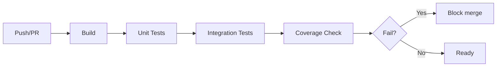

# Testing Strategy

## Test Levels

| Level | Framework | Location | CI |
|---|---|---|---|
| Unit | xUnit + FluentAssertions | `tests/Arcana.Core.Tests` | ✅ Always |
| Integration | xUnit | `tests/Arcana.Core.Tests` (Integration) | ✅ Always |
| UI | xUnit + Avalonia.Headless | `tests/Arcana.App.Tests` | ✅ Always |
| CLI | xUnit + System.CommandLine | `tests/Arcana.Core.Tests` (Cli) | ✅ Always |
| Compression | xUnit + Golden files | `tests/Arcana.Core.Tests` (Compression) | ✅ Always |

## Unit Tests

Test public API of each class in isolation. Mock external dependencies.

```csharp
public class ZipEngineTests
{
    [Fact]
    public void Name_ShouldReturnZip()
    {
        var engine = new ZipEngine();
        engine.Name.Should().Be("ZIP");
    }

    [Fact]
    public async Task OpenAsync_WithValidStream_ShouldReturnArchive()
    {
        // Arrange
        using var stream = TestData.CreateValidZipStream();
        var engine = new ZipEngine();

        // Act
        var archive = await engine.OpenAsync("test.zip", stream, AccessMode.Read);

        // Assert
        archive.Should().NotBeNull();
        archive.Entries.Should().NotBeEmpty();
        archive.Format.Should().Be(CompressionFormat.Zip);
    }
}
```

## Golden File Tests (Compression Roundtrip)

Create archive → extract → compare with original. This is the most important test.

```csharp
[Theory]
[InlineData(CompressionFormat.Zip, CompressionLevel.Normal)]
[InlineData(CompressionFormat.Zip, CompressionLevel.Maximum)]
[InlineData(CompressionFormat.SevenZip, CompressionLevel.Normal)]
[InlineData(CompressionFormat.Zstandard, CompressionLevel.Fast)]
public async Task CompressRoundtrip_PreservesData(CompressionFormat format, CompressionLevel level)
{
    // Arrange
    var testDir = TestData.GetTestDirectory("mixed-files");
    var outputPath = Path.GetTempFileName();
    var extractDir = Path.Combine(Path.GetTempPath(), Guid.NewGuid().ToString());

    try
    {
        // Act: Compress
        var options = new CompressionOptions { Format = format, Level = level };
        await ArchiveFactory.CompressDirectoryAsync(testDir, outputPath, options);

        // Act: Extract
        await ArchiveFactory.ExtractAsync(outputPath, extractDir);

        // Assert: Files match originals
        TestData.DirectoriesShouldMatch(testDir, extractDir);
    }
    finally
    {
        File.Delete(outputPath);
        Directory.Delete(extractDir, true);
    }
}
```

## Integration Tests

Test real compression with actual libraries (SharpCompress, ZstdNet).

```csharp
[Collection("CompressionIntegration")]
public class SevenZipIntegrationTests
{
    [Fact]
    public async Task OpenAsync_WithReal7zFile_ShouldReadEntriesCorrectly()
    {
        using var stream = File.OpenRead(TestData.GetFixturePath("sample.7z"));
        var engine = new SevenZipEngine();

        var archive = await engine.OpenAsync("sample.7z", stream, AccessMode.Read);

        archive.Entries.Should().Contain(e => e.Name == "document.txt");
        archive.Entries.Should().Contain(e => e.Name == "image.png");
    }
}
```

## Test Data

Test fixtures stored in `tests/Arcana.Core.Tests/Fixtures/`:

```
Fixtures/
├── archives/
│   ├── sample.zip        # Simple ZIP with 3 files
│   ├── sample.7z         # Simple 7z with 3 files
│   ├── sample.zst        # Zstd compressed file
│   ├── empty.zip         # Empty ZIP (0 entries)
│   ├── nested.zip        # Nested directories
│   ├── encrypted.zip     # AES-256 encrypted ZIP
│   └── corrupted.zip     # Deliberately corrupted
├── files/
│   ├── lorem-ipsum.txt   # 1KB text
│   ├── lorem-ipsum-large.txt  # 10MB text
│   ├── test-image.png    # 512x512 test pattern
│   └── random-1mb.bin    # Random binary
└── TestData.cs           # Helper to access fixtures
```

## Golden File Generation

Golden files (expected outputs for comparison) are generated using reference tools:

```shell
# Generate golden ZIP with 7-Zip
7z a tests/Fixtures/archives/reference.zip ./tests/Fixtures/files/

# Generate golden 7z with 7-Zip
7z a tests/Fixtures/archives/reference.7z ./tests/Fixtures/files/

# Generate golden Zstd with zstd CLI
zstd -o tests/Fixtures/archives/reference.zst ./tests/Fixtures/files/lorem-ipsum.txt
```

## Coverage Targets

| Module | Coverage Target |
|---|---|
| Arcana.Core (Compression) | 90% |
| Arcana.Core (Cryptography) | 95% |
| Arcana.Core (Filesystem) | 85% |
| Arcana.Core (Tools) | 80% |
| Arcana.Cli | 70% |
| Arcana.App (ViewModels) | 75% |

## Running Tests

```shell
# All tests
dotnet test src/Arcana.sln

# Core only
dotnet test tests/Arcana.Core.Tests

# With coverage
dotnet test src/Arcana.sln --collect:"XPlat Code Coverage"
```

## CI Pipeline

Tests run on every push and PR:


